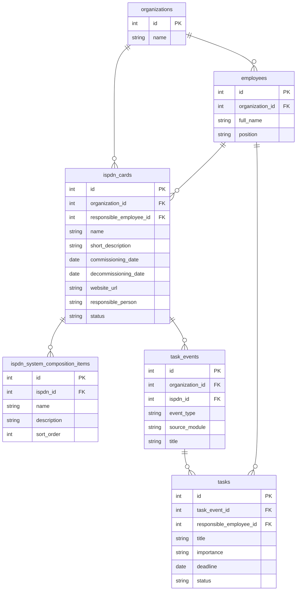
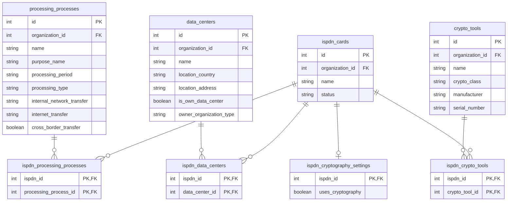
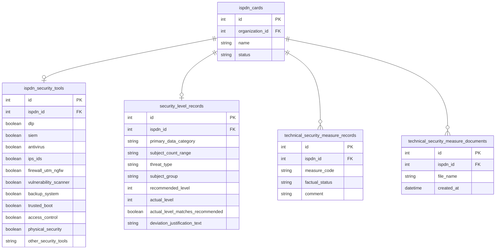

# ERD Source Data — Диаграммы 2.x. Карточка ИСПДн

## 1. Scope

Анализ покрывает таблицы карточки ИСПДн и сущности, которые напрямую связаны с `ispdn_cards`: tenant-организацию, ответственного сотрудника, структурированный состав ИСПДн, средства защиты внутри ИСПДн, уровень защищённости, технические меры защиты, документы модуля технических мер, процессы обработки, ЦОД, СКЗИ, настройки использования криптографии, задачи и события.

Таблица `organizations` включена только как родительская tenant-сущность. Таблицы ролей, пользователей, логов, уведомлений и карточки организации не включались в диаграммы, так как не относятся напрямую к блоку карточки ИСПДн.

## 2. Data sources checked

| Source | Checked | Result |
|---|---:|---|
| SQLAlchemy models | yes | Проверены модели `ispdn.py`, `employee.py`, `security_level.py`, `security_measure.py`, `processing_process.py`, `ispdn_processing_process.py`, `data_center.py`, `crypto_tool.py`, `task_event.py`, `organization.py`. |
| Alembic migrations | yes | Проверены миграции `20260503_0001`...`20260522_0026`; состав ИСПДн вынесен из `ispdn_cards.system_composition` в `ispdn_system_composition_items`. |
| PostgreSQL information_schema | yes | Локальная PostgreSQL доступна; read-only запросы к `information_schema` выполнены по найденному списку таблиц. Значение `DATABASE_URL` в отчёте не раскрывается. |
| Pydantic schemas | yes | Проверены схемы `ispdn.py`, `security_level.py`, `security_measure.py`, `processing_process.py`, `data_center.py`, `crypto_tool.py`, `task_event.py` для уточнения назначения полей. |
| Repositories | yes | Проверены репозитории `ispdn.py`, `security_level.py`, `security_measure.py`, `processing_process.py`, `data_center.py`, `crypto_tool.py`, `task_event.py` для уточнения сценариев связей. |

## 3. Tables

### organizations

Назначение:
Tenant-сущность организации. Используется как родитель для бизнес-данных, включая карточки ИСПДн, сотрудников, процессы обработки, ЦОД, СКЗИ и события задач.

Columns:

| column | type | nullable | primary_key | foreign_key | default | notes |
|---|---|---:|---:|---|---|---|
| id | integer | no | yes |  | nextval | Идентификатор организации. |
| name | varchar(255) | no | no |  |  | Название tenant-организации. |
| created_at | timestamp | no | no |  | now() | Служебное поле. |
| updated_at | timestamp | no | no |  | now() | Служебное поле. |

Constraints:

| constraint | type | columns | details |
|---|---|---|---|
| organizations_pkey | primary key | id | Реальная БД. |

Relationships:

| from | to | type | on_delete | explanation |
|---|---|---|---|---|
| organizations.id | ispdn_cards.organization_id | 1:N | CASCADE | Организация владеет карточками ИСПДн. |
| organizations.id | employees.organization_id | 1:N | CASCADE | Организация владеет сотрудниками. |
| organizations.id | processing_processes.organization_id | 1:N | CASCADE | Организация владеет каноническими процессами обработки. |
| organizations.id | data_centers.organization_id | 1:N | CASCADE | Организация владеет реестром ЦОД. |
| organizations.id | crypto_tools.organization_id | 1:N | CASCADE | Организация владеет реестром СКЗИ. |
| organizations.id | task_events.organization_id | 1:N | CASCADE | Организация владеет событиями задач. |

### employees

Назначение:
Реестр сотрудников организации. Для блока ИСПДн важен как источник ответственного за обработку ПДн и ответственного по задачам.

Columns:

| column | type | nullable | primary_key | foreign_key | default | notes |
|---|---|---:|---:|---|---|---|
| id | integer | no | yes |  | nextval | Идентификатор сотрудника. |
| full_name | varchar(255) | no | no |  |  | ФИО сотрудника. |
| position | varchar(255) | no | no |  |  | Должность. |
| document_initials | varchar(255) | no | no |  |  | Инициалы для документов. |
| department_id | integer | yes | no | departments.id |  | Связь с подразделением, в диаграмму 2.x не включать. |
| created_at | timestamp | no | no |  | now() | Служебное поле. |
| updated_at | timestamp | no | no |  | now() | Служебное поле. |
| phone_number | varchar(32) | yes | no |  |  | Контактное поле. |
| email | varchar(255) | yes | no |  |  | Контактное поле. |
| organization_id | integer | no | no | organizations.id |  | Tenant scope. |

Constraints:

| constraint | type | columns | details |
|---|---|---|---|
| employees_pkey | primary key | id | Реальная БД. |
| fk_employees_organization_id_organizations | foreign key | organization_id | `ON DELETE CASCADE`. |
| fk_employees_department_id_departments | foreign key | department_id | `ON DELETE SET NULL`; вне области диаграммы 2.x. |

Relationships:

| from | to | type | on_delete | explanation |
|---|---|---|---|---|
| employees.organization_id | organizations.id | N:1 | CASCADE | Сотрудник принадлежит организации. |
| ispdn_cards.responsible_employee_id | employees.id | N:1 | SET NULL in DB | Ответственный сотрудник карточки ИСПДн. |
| tasks.responsible_employee_id | employees.id | N:1 | SET NULL | Ответственный по задаче. |

### ispdn_cards

Назначение:
Центральная таблица карточек ИСПДн. От неё строятся связи с базовыми сведениями, процессами обработки, ЦОД, СКЗИ, уровнем защищённости, техническими мерами и задачами.

Columns:

| column | type | nullable | primary_key | foreign_key | default | notes |
|---|---|---:|---:|---|---|---|
| id | integer | no | yes |  | nextval | Идентификатор карточки ИСПДн. |
| name | varchar(255) | no | no |  |  | Название ИСПДн. |
| short_description | text | no | no |  |  | Краткое описание. |
| commissioning_date | date | no | no |  |  | Дата ввода в эксплуатацию. |
| decommissioning_date | date | yes | no |  |  | Дата вывода из эксплуатации. |
| website_url | varchar(2048) | yes | no |  |  | Сайт ИСПДн. |
| responsible_person | varchar(255) | no | no |  |  | Текстовое имя ответственного, сохраняется для совместимости и отображения. |
| status | varchar(32) | no | no |  |  | `active` или `archived`; Python default в модели `active`, DB default отсутствует. |
| created_at | timestamp | no | no |  | now() | Служебное поле. |
| updated_at | timestamp | no | no |  | now() | Служебное поле. |
| responsible_employee_id | integer | yes | no | employees.id |  | Ответственный сотрудник. |
| organization_id | integer | no | no | organizations.id |  | Tenant scope. |

Constraints:

| constraint | type | columns | details |
|---|---|---|---|
| ispdn_cards_pkey | primary key | id | Реальная БД. |
| ck_ispdn_cards_status | check | status | `status IN ('active', 'archived')`. |
| ck_ispdn_cards_decommissioning_date | check | decommissioning_date, commissioning_date | `decommissioning_date IS NULL OR decommissioning_date >= commissioning_date`. |
| fk_ispdn_cards_organization_id_organizations | foreign key | organization_id | `ON DELETE CASCADE`. |
| fk_ispdn_cards_responsible_employee_id_employees | foreign key | responsible_employee_id | В реальной БД `ON DELETE SET NULL`; в SQLAlchemy-модели указано `RESTRICT`. |

Relationships:

| from | to | type | on_delete | explanation |
|---|---|---|---|---|
| ispdn_cards.organization_id | organizations.id | N:1 | CASCADE | Карточка принадлежит организации. |
| ispdn_cards.responsible_employee_id | employees.id | N:1 | SET NULL in DB | Ответственный сотрудник. |
| ispdn_cards.id | ispdn_system_composition_items.ispdn_id | 1:N | CASCADE | Структурированный состав ИСПДн. |
| ispdn_cards.id | ispdn_security_tools.ispdn_id | 1:0..1 | CASCADE | Флаги средств защиты внутри ИСПДн. |
| ispdn_cards.id | security_level_records.ispdn_id | 1:0..1 | CASCADE | Запись уровня защищённости. |
| ispdn_cards.id | technical_security_measure_records.ispdn_id | 1:N | CASCADE | Фактические статусы мер защиты. |
| ispdn_cards.id | technical_security_measure_documents.ispdn_id | 1:N | CASCADE | Документы по техническим мерам. |
| ispdn_cards.id | ispdn_processing_processes.ispdn_id | 1:N | CASCADE | Связь с процессами обработки. |
| ispdn_cards.id | ispdn_data_centers.ispdn_id | 1:N | CASCADE | Связь с ЦОД. |
| ispdn_cards.id | ispdn_crypto_tools.ispdn_id | 1:N | CASCADE | Связь со СКЗИ. |
| ispdn_cards.id | ispdn_cryptography_settings.ispdn_id | 1:0..1 | CASCADE | Настройка использования криптографии. |
| ispdn_cards.id | task_events.ispdn_id | 1:N | CASCADE | События задач, привязанные к ИСПДн; `ispdn_id` nullable. |

### ispdn_system_composition_items

Назначение:
Структурированный состав ИСПДн. Заменяет старое текстовое поле `ispdn_cards.system_composition`, которое удаляется миграцией `20260522_0026`.

Columns:

| column | type | nullable | primary_key | foreign_key | default | notes |
|---|---|---:|---:|---|---|---|
| id | integer | no | yes |  | nextval | Идентификатор элемента состава. |
| ispdn_id | integer | no | no | ispdn_cards.id |  | Родительская карточка ИСПДн. |
| name | varchar(255) | no | no |  |  | Название элемента состава. |
| description | text | no | no |  |  | Описание элемента состава. |
| sort_order | integer | no | no |  |  | Порядок отображения. |

Constraints:

| constraint | type | columns | details |
|---|---|---|---|
| ispdn_system_composition_items_pkey | primary key | id | Реальная БД. |
| fk_ispdn_system_composition_items_ispdn_id_ispdn_cards | foreign key | ispdn_id | `ON DELETE CASCADE`. |

Relationships:

| from | to | type | on_delete | explanation |
|---|---|---|---|---|
| ispdn_system_composition_items.ispdn_id | ispdn_cards.id | N:1 | CASCADE | Элемент состава принадлежит одной карточке ИСПДн. |

### ispdn_security_tools

Назначение:
Фиксирует наличие средств защиты внутри конкретной ИСПДн. Это справочная часть карточки и не закрывает технические меры автоматически.

Columns:

| column | type | nullable | primary_key | foreign_key | default | notes |
|---|---|---:|---:|---|---|---|
| id | integer | no | yes |  | nextval | Идентификатор записи. |
| ispdn_id | integer | no | no | ispdn_cards.id |  | Уникальная связь с карточкой ИСПДн. |
| dlp | boolean | no | no |  | false | Наличие DLP. |
| siem | boolean | no | no |  | false | Наличие SIEM. |
| antivirus | boolean | no | no |  | false | Наличие антивируса. |
| ips_ids | boolean | no | no |  | false | Наличие IPS/IDS. |
| firewall_utm_ngfw | boolean | no | no |  | false | Наличие firewall/UTM/NGFW. |
| vulnerability_scanner | boolean | no | no |  | false | Наличие сканера уязвимостей. |
| backup_system | boolean | no | no |  | false | Наличие системы резервного копирования. |
| trusted_boot | boolean | no | no |  | false | Наличие доверенной загрузки. |
| access_control | boolean | no | no |  | false | Наличие контроля доступа. |
| physical_security | boolean | no | no |  | false | Наличие физической защиты. |
| other_security_tools | text | yes | no |  |  | Прочие средства защиты. |
| created_at | timestamp | no | no |  | now() | Служебное поле. |
| updated_at | timestamp | no | no |  | now() | Служебное поле. |

Constraints:

| constraint | type | columns | details |
|---|---|---|---|
| ispdn_security_tools_pkey | primary key | id | Реальная БД. |
| uq_ispdn_security_tools_ispdn_id | unique | ispdn_id | Одна запись средств защиты на одну ИСПДн. |
| fk_ispdn_security_tools_ispdn_id_ispdn_cards | foreign key | ispdn_id | `ON DELETE CASCADE`. |

Relationships:

| from | to | type | on_delete | explanation |
|---|---|---|---|---|
| ispdn_security_tools.ispdn_id | ispdn_cards.id | 0..1:1 | CASCADE | Средства защиты относятся к одной карточке ИСПДн. |

### security_level_records

Назначение:
Хранит исходные данные и результат расчёта уровня защищённости для конкретной ИСПДн. Уникальность `ispdn_id` делает связь фактически 1:0..1.

Columns:

| column | type | nullable | primary_key | foreign_key | default | notes |
|---|---|---:|---:|---|---|---|
| id | integer | no | yes |  | nextval | Идентификатор записи. |
| ispdn_id | integer | no | no | ispdn_cards.id |  | Родительская карточка ИСПДн. |
| data_categories | jsonb | no | no |  |  | Категории обрабатываемых ПДн; ключевое смысловое JSONB-поле. |
| primary_data_category | varchar(32) | no | no |  |  | Главная категория ПДн для расчёта. |
| subject_count_range | varchar(32) | no | no |  |  | Диапазон количества субъектов. |
| threat_type | varchar(32) | no | no |  |  | Тип актуальных угроз. |
| subject_group | varchar(32) | no | no |  |  | Группа субъектов. |
| employee_only | boolean | no | no |  |  | Признак обработки только сотрудников. |
| recommended_level | integer | no | no |  |  | Рассчитанный уровень. |
| actual_level | integer | no | no |  |  | Фактически выбранный уровень. |
| actual_level_matches_recommended | boolean | no | no |  |  | Совпадает ли выбранный уровень с рекомендованным. |
| deviation_justification_text | text | yes | no |  |  | Пояснение отклонения. |
| deviation_justification_file_path | varchar(2048) | yes | no |  |  | Путь к файлу; скрывать на ERD. |
| deviation_justification_file_name | varchar(255) | yes | no |  |  | Имя файла. |
| deviation_justification_file_content_type | varchar(255) | yes | no |  |  | MIME-тип файла; скрывать на ERD. |
| created_at | timestamp | no | no |  | now() | Служебное поле. |
| updated_at | timestamp | no | no |  | now() | Служебное поле. |

Constraints:

| constraint | type | columns | details |
|---|---|---|---|
| security_level_records_pkey | primary key | id | Реальная БД. |
| uq_security_level_records_ispdn_id | unique | ispdn_id | Одна запись уровня защищённости на одну ИСПДн. |
| fk_security_level_records_ispdn_id_ispdn_cards | foreign key | ispdn_id | `ON DELETE CASCADE`. |
| ck_security_level_subject_count_range | check | subject_count_range | `more_than_100k`, `less_than_100k`. |
| ck_security_level_threat_type | check | threat_type | `threat_type_1`, `threat_type_2`, `threat_type_3`. |
| ck_security_level_subject_group | check | subject_group | `clients_only`, `employees_only`, `employees_and_clients`. |
| ck_security_level_recommended_level | check | recommended_level | 1..4. |
| ck_security_level_actual_level | check | actual_level | 1..4. |

Relationships:

| from | to | type | on_delete | explanation |
|---|---|---|---|---|
| security_level_records.ispdn_id | ispdn_cards.id | 0..1:1 | CASCADE | Запись уровня защищённости принадлежит одной ИСПДн. |

### technical_security_measure_records

Назначение:
Хранит фактический статус конкретной технической меры ФСТЭК для выбранной ИСПДн. Справочник мер находится в backend domain-коде, а не в отдельной таблице.

Columns:

| column | type | nullable | primary_key | foreign_key | default | notes |
|---|---|---:|---:|---|---|---|
| id | integer | no | yes |  | nextval | Идентификатор записи. |
| ispdn_id | integer | no | no | ispdn_cards.id |  | Родительская карточка ИСПДн. |
| measure_code | varchar(32) | no | no |  |  | Код меры из доменного справочника ФСТЭК №21. |
| factual_status | varchar(32) | no | no |  |  | `implemented` или `not_implemented`. |
| created_at | timestamp | no | no |  | now() | Служебное поле. |
| updated_at | timestamp | no | no |  | now() | Служебное поле. |
| comment | text | yes | no |  |  | Пояснение реализации или отклонения. |

Constraints:

| constraint | type | columns | details |
|---|---|---|---|
| technical_security_measure_records_pkey | primary key | id | Реальная БД. |
| uq_technical_security_measure_records_ispdn_measure | unique | ispdn_id, measure_code | Одна запись на меру внутри одной ИСПДн. |
| fk_technical_security_measure_records_ispdn_id_ispdn_cards | foreign key | ispdn_id | `ON DELETE CASCADE`. |
| ck_technical_security_measure_records_factual_status | check | factual_status | `implemented`, `not_implemented`. |

Relationships:

| from | to | type | on_delete | explanation |
|---|---|---|---|---|
| technical_security_measure_records.ispdn_id | ispdn_cards.id | N:1 | CASCADE | Мера относится к одной ИСПДн. |

### technical_security_measure_documents

Назначение:
Хранит загруженные документы модуля технических мер защиты на уровне конкретной ИСПДн. Документы не привязаны к отдельной мере.

Columns:

| column | type | nullable | primary_key | foreign_key | default | notes |
|---|---|---:|---:|---|---|---|
| id | integer | no | yes |  | nextval | Идентификатор документа. |
| ispdn_id | integer | no | no | ispdn_cards.id |  | Родительская карточка ИСПДн. |
| file_path | varchar(2048) | no | no |  |  | Локальный путь; скрывать на ERD. |
| file_name | varchar(255) | no | no |  |  | Имя файла. |
| file_content_type | varchar(255) | no | no |  |  | MIME-тип; скрывать на ERD. |
| file_size_bytes | bigint | no | no |  |  | Размер файла; скрывать на ERD. |
| created_at | timestamp | no | no |  | now() | Дата загрузки. |

Constraints:

| constraint | type | columns | details |
|---|---|---|---|
| technical_security_measure_documents_pkey | primary key | id | Реальная БД. |
| fk_technical_security_measure_documents_ispdn_id_ispdn_cards | foreign key | ispdn_id | `ON DELETE CASCADE`. |

Relationships:

| from | to | type | on_delete | explanation |
|---|---|---|---|---|
| technical_security_measure_documents.ispdn_id | ispdn_cards.id | N:1 | CASCADE | Документ относится к одной ИСПДн. |

### processing_processes

Назначение:
Канонический процесс обработки персональных данных в рамках организации. С ИСПДн связан через many-to-many таблицу `ispdn_processing_processes`.

Columns:

| column | type | nullable | primary_key | foreign_key | default | notes |
|---|---|---:|---:|---|---|---|
| id | integer | no | yes |  | nextval | Идентификатор процесса. |
| name | varchar(255) | no | no |  |  | Название процесса; обычно совпадает с целью. |
| purpose_name | varchar(255) | no | no |  | Название цели обработки. |
| processing_period | varchar(1000) | no | no |  |  | Период обработки. |
| subject_categories | jsonb | no | no |  |  | Категории субъектов; ключевое смысловое JSONB-поле. |
| data_categories | jsonb | no | no |  |  | Категории ПДн; ключевое смысловое JSONB-поле. |
| legal_bases | jsonb | no | no |  |  | Правовые основания; ключевое смысловое JSONB-поле. |
| personal_data_actions | jsonb | no | no |  |  | Действия с ПДн; ключевое смысловое JSONB-поле. |
| processing_type | varchar(32) | no | no |  |  | Тип обработки. |
| internal_network_transfer | varchar(64) | no | no |  |  | Передача по внутренней сети. |
| internet_transfer | varchar(64) | no | no |  |  | Передача через Интернет. |
| cross_border_transfer | boolean | no | no |  |  | Факт трансграничной передачи. |
| process_signature | varchar(64) | no | no |  |  | Служебная сигнатура уникальности; скрывать на ERD. |
| created_at | timestamp | no | no |  | now() | Служебное поле. |
| updated_at | timestamp | no | no |  | now() | Служебное поле. |
| organization_id | integer | no | no | organizations.id |  | Tenant scope. |

Constraints:

| constraint | type | columns | details |
|---|---|---|---|
| processing_processes_new_pkey | primary key | id | В реальной БД имя PK осталось от временной таблицы миграции rename. |
| uq_processing_processes_org_signature | unique | organization_id, process_signature | Уникальность канонического процесса внутри организации. |
| fk_processing_processes_organization_id_organizations | foreign key | organization_id | `ON DELETE CASCADE`. |
| ck_processing_processes_name_not_empty | check | name | Непустое имя. |
| ck_processing_processes_purpose_name_not_empty | check | purpose_name | Непустое название цели. |
| ck_processing_processes_processing_period_not_empty | check | processing_period | Непустой период. |
| ck_processing_processes_processing_type | check | processing_type | `automated`, `non_automated`, `mixed`. |
| ck_processing_processes_internal_network_transfer | check | internal_network_transfer | `no_internal_network_transfer`, `with_internal_network_transfer`. |
| ck_processing_processes_internet_transfer | check | internet_transfer | `no_internet_transfer`, `with_internet_transfer`. |

Relationships:

| from | to | type | on_delete | explanation |
|---|---|---|---|---|
| processing_processes.organization_id | organizations.id | N:1 | CASCADE | Процесс принадлежит организации. |
| processing_processes.id | ispdn_processing_processes.processing_process_id | 1:N | RESTRICT | Процесс связан с ИСПДн через таблицу связей. |

### ispdn_processing_processes

Назначение:
Связующая таблица many-to-many между карточками ИСПДн и процессами обработки.

Columns:

| column | type | nullable | primary_key | foreign_key | default | notes |
|---|---|---:|---:|---|---|---|
| ispdn_id | integer | no | yes | ispdn_cards.id |  | Часть составного PK. |
| processing_process_id | integer | no | yes | processing_processes.id |  | Часть составного PK. |
| created_at | timestamp | no | no |  | now() | Дата привязки процесса к ИСПДн. |

Constraints:

| constraint | type | columns | details |
|---|---|---|---|
| ispdn_processing_processes_pkey | primary key | ispdn_id, processing_process_id | Запрещает дубль связи. |
| fk_ispdn_processing_processes_ispdn_id_ispdn_cards | foreign key | ispdn_id | `ON DELETE CASCADE`. |
| fk_ispdn_processing_processes_process_id_processes | foreign key | processing_process_id | `ON DELETE RESTRICT`. |

Relationships:

| from | to | type | on_delete | explanation |
|---|---|---|---|---|
| ispdn_processing_processes.ispdn_id | ispdn_cards.id | N:1 | CASCADE | Связь принадлежит одной ИСПДн. |
| ispdn_processing_processes.processing_process_id | processing_processes.id | N:1 | RESTRICT | Связь указывает на один процесс обработки. |

### data_centers

Назначение:
Реестр ЦОД организации. С конкретными ИСПДн связан через many-to-many таблицу `ispdn_data_centers`.

Columns:

| column | type | nullable | primary_key | foreign_key | default | notes |
|---|---|---:|---:|---|---|---|
| id | integer | no | yes |  | nextval | Идентификатор ЦОД. |
| name | varchar(255) | no | no |  |  | Название ЦОД. |
| location_country | varchar(255) | no | no |  |  | Страна размещения. |
| location_address | varchar(1000) | no | no |  |  | Адрес размещения. |
| is_own_data_center | boolean | no | no |  |  | Собственный или сторонний ЦОД. |
| owner_organization_type | varchar(64) | yes | no |  |  | Тип владельца стороннего ЦОД. |
| owner_person_full_name | varchar(255) | yes | no |  |  | ФИО владельца-физлица/ИП. |
| owner_organization_name | varchar(255) | yes | no |  |  | Название организации-владельца. |
| owner_ogrnip | varchar(64) | yes | no |  |  | ОГРНИП владельца. |
| owner_ogrn | varchar(64) | yes | no |  |  | ОГРН владельца. |
| owner_inn | varchar(64) | yes | no |  |  | ИНН владельца. |
| owner_location_country | varchar(255) | yes | no |  |  | Страна владельца. |
| owner_location_address | varchar(1000) | yes | no |  |  | Адрес владельца. |
| created_at | timestamp | no | no |  | now() | Служебное поле. |
| updated_at | timestamp | no | no |  | now() | Служебное поле. |
| organization_id | integer | no | no | organizations.id |  | Tenant scope. |

Constraints:

| constraint | type | columns | details |
|---|---|---|---|
| data_centers_pkey | primary key | id | Реальная БД. |
| fk_data_centers_organization_id_organizations | foreign key | organization_id | `ON DELETE CASCADE`. |
| ck_data_centers_name_not_empty | check | name | Непустое имя. |
| ck_data_centers_location_country_not_empty | check | location_country | Непустая страна. |
| ck_data_centers_location_address_not_empty | check | location_address | Непустой адрес. |
| ck_data_centers_owner_organization_type | check | owner_organization_type | `individual`, `foreign_organization`, `individual_entrepreneur`, `legal_entity` или NULL. |

Relationships:

| from | to | type | on_delete | explanation |
|---|---|---|---|---|
| data_centers.organization_id | organizations.id | N:1 | CASCADE | ЦОД принадлежит организации. |
| data_centers.id | ispdn_data_centers.data_center_id | 1:N | CASCADE | ЦОД связан с ИСПДн через таблицу связей. |

### ispdn_data_centers

Назначение:
Связующая таблица many-to-many между карточками ИСПДн и ЦОД.

Columns:

| column | type | nullable | primary_key | foreign_key | default | notes |
|---|---|---:|---:|---|---|---|
| ispdn_id | integer | no | yes | ispdn_cards.id |  | Часть составного PK. |
| data_center_id | integer | no | yes | data_centers.id |  | Часть составного PK. |
| created_at | timestamp | no | no |  | now() | Дата привязки ЦОД к ИСПДн. |

Constraints:

| constraint | type | columns | details |
|---|---|---|---|
| ispdn_data_centers_pkey | primary key | ispdn_id, data_center_id | Запрещает дубль связи. |
| fk_ispdn_data_centers_ispdn_id_ispdn_cards | foreign key | ispdn_id | `ON DELETE CASCADE`. |
| fk_ispdn_data_centers_data_center_id_data_centers | foreign key | data_center_id | `ON DELETE CASCADE`. |

Relationships:

| from | to | type | on_delete | explanation |
|---|---|---|---|---|
| ispdn_data_centers.ispdn_id | ispdn_cards.id | N:1 | CASCADE | Связь принадлежит одной ИСПДн. |
| ispdn_data_centers.data_center_id | data_centers.id | N:1 | CASCADE | Связь указывает на один ЦОД. |

### crypto_tools

Назначение:
Реестр СКЗИ организации. С конкретными ИСПДн связан через many-to-many таблицу `ispdn_crypto_tools`.

Columns:

| column | type | nullable | primary_key | foreign_key | default | notes |
|---|---|---:|---:|---|---|---|
| id | integer | no | yes |  | nextval | Идентификатор СКЗИ. |
| name | varchar(255) | no | no |  |  | Название СКЗИ. |
| crypto_class | varchar(16) | no | no |  |  | Класс СКЗИ: `KS1`, `KS2`, `KS3`, `KV`, `KA`. |
| manufacturer | varchar(255) | no | no |  |  | Производитель. |
| serial_number | varchar(255) | no | no |  |  | Серийный номер. |
| created_at | timestamp | no | no |  | now() | Служебное поле. |
| updated_at | timestamp | no | no |  | now() | Служебное поле. |
| organization_id | integer | no | no | organizations.id |  | Tenant scope. |

Constraints:

| constraint | type | columns | details |
|---|---|---|---|
| crypto_tools_pkey | primary key | id | Реальная БД. |
| fk_crypto_tools_organization_id_organizations | foreign key | organization_id | `ON DELETE CASCADE`. |
| ck_crypto_tools_name_not_empty | check | name | Непустое имя. |
| ck_crypto_tools_manufacturer_not_empty | check | manufacturer | Непустой производитель. |
| ck_crypto_tools_serial_number_not_empty | check | serial_number | Непустой серийный номер. |
| ck_crypto_tools_crypto_class | check | crypto_class | `KS1`, `KS2`, `KS3`, `KV`, `KA`. |

Relationships:

| from | to | type | on_delete | explanation |
|---|---|---|---|---|
| crypto_tools.organization_id | organizations.id | N:1 | CASCADE | СКЗИ принадлежит организации. |
| crypto_tools.id | ispdn_crypto_tools.crypto_tool_id | 1:N | CASCADE | СКЗИ связан с ИСПДн через таблицу связей. |

### ispdn_crypto_tools

Назначение:
Связующая таблица many-to-many между карточками ИСПДн и СКЗИ.

Columns:

| column | type | nullable | primary_key | foreign_key | default | notes |
|---|---|---:|---:|---|---|---|
| ispdn_id | integer | no | yes | ispdn_cards.id |  | Часть составного PK. |
| crypto_tool_id | integer | no | yes | crypto_tools.id |  | Часть составного PK. |
| created_at | timestamp | no | no |  | now() | Дата привязки СКЗИ к ИСПДн. |

Constraints:

| constraint | type | columns | details |
|---|---|---|---|
| ispdn_crypto_tools_pkey | primary key | ispdn_id, crypto_tool_id | Запрещает дубль связи. |
| fk_ispdn_crypto_tools_ispdn_id_ispdn_cards | foreign key | ispdn_id | `ON DELETE CASCADE`. |
| fk_ispdn_crypto_tools_crypto_tool_id_crypto_tools | foreign key | crypto_tool_id | `ON DELETE CASCADE`. |

Relationships:

| from | to | type | on_delete | explanation |
|---|---|---|---|---|
| ispdn_crypto_tools.ispdn_id | ispdn_cards.id | N:1 | CASCADE | Связь принадлежит одной ИСПДн. |
| ispdn_crypto_tools.crypto_tool_id | crypto_tools.id | N:1 | CASCADE | Связь указывает на одно СКЗИ. |

### ispdn_cryptography_settings

Назначение:
Настройки использования криптографии в конкретной ИСПДн. Список СКЗИ хранится отдельно в `ispdn_crypto_tools`.

Columns:

| column | type | nullable | primary_key | foreign_key | default | notes |
|---|---|---:|---:|---|---|---|
| ispdn_id | integer | no | yes | ispdn_cards.id |  | Одновременно PK и FK к карточке ИСПДн. |
| uses_cryptography | boolean | no | no |  | false | Используется ли криптография. |
| created_at | timestamp | no | no |  | now() | Служебное поле. |
| updated_at | timestamp | no | no |  | now() | Служебное поле. |

Constraints:

| constraint | type | columns | details |
|---|---|---|---|
| ispdn_cryptography_settings_pkey | primary key | ispdn_id | Одна настройка криптографии на одну ИСПДн. |
| fk_ispdn_cryptography_settings_ispdn_id_ispdn_cards | foreign key | ispdn_id | `ON DELETE CASCADE`. |

Relationships:

| from | to | type | on_delete | explanation |
|---|---|---|---|---|
| ispdn_cryptography_settings.ispdn_id | ispdn_cards.id | 0..1:1 | CASCADE | Настройки относятся к одной карточке ИСПДн. |

### task_events

Назначение:
События, на базе которых создаются задачи. Могут быть привязаны к конкретной ИСПДн или быть общими для организации.

Columns:

| column | type | nullable | primary_key | foreign_key | default | notes |
|---|---|---:|---:|---|---|---|
| id | integer | no | yes |  | nextval | Идентификатор события. |
| ispdn_id | integer | yes | no | ispdn_cards.id |  | Nullable после миграции `20260515_0022`; только непустые значения включать в контекст ИСПДн. |
| event_type | varchar(128) | no | no |  |  | Тип события. |
| source_module | varchar(128) | no | no |  |  | Модуль-источник. |
| title | varchar(255) | no | no |  |  | Заголовок события. |
| description | text | yes | no |  |  | Описание события. |
| created_at | timestamp | no | no |  | now() | Служебное поле. |
| updated_at | timestamp | no | no |  | now() | Служебное поле. |
| automation_key | varchar(255) | yes | no |  |  | Ключ автоматизации; уникальный индекс `ix_task_events_automation_key`. |
| organization_id | integer | no | no | organizations.id |  | Tenant scope. |

Constraints:

| constraint | type | columns | details |
|---|---|---|---|
| task_events_pkey | primary key | id | Реальная БД. |
| fk_task_events_ispdn_id_ispdn_cards | foreign key | ispdn_id | `ON DELETE CASCADE`; колонка nullable. |
| fk_task_events_organization_id_organizations | foreign key | organization_id | `ON DELETE CASCADE`. |
| ix_task_events_automation_key | unique index | automation_key | Уникальный индекс, не `UNIQUE` constraint в `information_schema.table_constraints`. |
| ck_task_events_event_type_not_empty | check | event_type | Непустой тип события. |
| ck_task_events_source_module_not_empty | check | source_module | Непустой модуль-источник. |
| ck_task_events_title_not_empty | check | title | Непустой заголовок. |

Relationships:

| from | to | type | on_delete | explanation |
|---|---|---|---|---|
| task_events.organization_id | organizations.id | N:1 | CASCADE | Событие принадлежит организации. |
| task_events.ispdn_id | ispdn_cards.id | N:0..1 | CASCADE | Событие может быть связано с ИСПДн. |
| task_events.id | tasks.task_event_id | 1:N | CASCADE | Событие содержит задачи. |

### tasks

Назначение:
Задачи, созданные вручную или автоматически на базе `task_events`. Привязка к ИСПДн наследуется через `task_event_id`.

Columns:

| column | type | nullable | primary_key | foreign_key | default | notes |
|---|---|---:|---:|---|---|---|
| id | integer | no | yes |  | nextval | Идентификатор задачи. |
| task_event_id | integer | no | no | task_events.id |  | Родительское событие. |
| title | varchar(255) | no | no |  |  | Заголовок задачи. |
| description | text | yes | no |  |  | Описание задачи. |
| importance | varchar(32) | yes | no |  |  | `low`, `medium`, `high`, `critical` или NULL. |
| deadline | date | yes | no |  |  | Срок исполнения. |
| responsible_employee_id | integer | yes | no | employees.id |  | Ответственный сотрудник. |
| status | varchar(32) | no | no |  | `'pending'` | Статус задачи. |
| created_at | timestamp | no | no |  | now() | Служебное поле. |
| updated_at | timestamp | no | no |  | now() | Служебное поле. |
| automation_key | varchar(255) | yes | no |  |  | Ключ автоматизации в рамках события. |

Constraints:

| constraint | type | columns | details |
|---|---|---|---|
| tasks_pkey | primary key | id | Реальная БД. |
| uq_tasks_event_automation_key | unique | task_event_id, automation_key | Запрещает дубль автоматической задачи внутри события. |
| fk_tasks_task_event_id_task_events | foreign key | task_event_id | `ON DELETE CASCADE`. |
| fk_tasks_responsible_employee_id_employees | foreign key | responsible_employee_id | `ON DELETE SET NULL`. |
| ck_tasks_importance | check | importance | `low`, `medium`, `high`, `critical` или NULL. |
| ck_tasks_status | check | status | `pending`, `in_progress`, `done`. |
| ck_tasks_title_not_empty | check | title | Непустой заголовок. |

Relationships:

| from | to | type | on_delete | explanation |
|---|---|---|---|---|
| tasks.task_event_id | task_events.id | N:1 | CASCADE | Задача принадлежит событию. |
| tasks.responsible_employee_id | employees.id | N:0..1 | SET NULL | Задача может иметь ответственного сотрудника. |

## 4. Relationships summary

| left_table | left_column | right_table | right_column | cardinality | implementation | on_delete | include_in_diagram |
|---|---|---|---|---|---|---|---|
| organizations | id | ispdn_cards | organization_id | 1:N | FK in `ispdn_cards.organization_id` | CASCADE | yes, 2.1 |
| organizations | id | employees | organization_id | 1:N | FK in `employees.organization_id` | CASCADE | yes, 2.1 only as tenant context if needed |
| employees | id | ispdn_cards | responsible_employee_id | 1:N | FK in `ispdn_cards.responsible_employee_id` | SET NULL in DB, RESTRICT in model | yes, 2.1 |
| ispdn_cards | id | ispdn_system_composition_items | ispdn_id | 1:N | FK in `ispdn_system_composition_items.ispdn_id` | CASCADE | yes, 2.1 |
| ispdn_cards | id | ispdn_security_tools | ispdn_id | 1:0..1 | FK plus unique `ispdn_id` | CASCADE | yes, 2.3 |
| ispdn_cards | id | security_level_records | ispdn_id | 1:0..1 | FK plus unique `ispdn_id` | CASCADE | yes, 2.3 |
| ispdn_cards | id | technical_security_measure_records | ispdn_id | 1:N | FK plus unique `(ispdn_id, measure_code)` | CASCADE | yes, 2.3 |
| ispdn_cards | id | technical_security_measure_documents | ispdn_id | 1:N | FK | CASCADE | yes, 2.3 |
| ispdn_cards | id | processing_processes | id | M:N | Via `ispdn_processing_processes` | CASCADE from card, RESTRICT from process | yes, 2.2 |
| ispdn_cards | id | ispdn_processing_processes | ispdn_id | 1:N | Association table | CASCADE | yes, 2.2 |
| processing_processes | id | ispdn_processing_processes | processing_process_id | 1:N | Association table | RESTRICT | yes, 2.2 |
| ispdn_cards | id | data_centers | id | M:N | Via `ispdn_data_centers` | CASCADE from both sides | yes, 2.2 |
| ispdn_cards | id | ispdn_data_centers | ispdn_id | 1:N | Association table | CASCADE | yes, 2.2 |
| data_centers | id | ispdn_data_centers | data_center_id | 1:N | Association table | CASCADE | yes, 2.2 |
| ispdn_cards | id | crypto_tools | id | M:N | Via `ispdn_crypto_tools` | CASCADE from both sides | yes, 2.2 |
| ispdn_cards | id | ispdn_crypto_tools | ispdn_id | 1:N | Association table | CASCADE | yes, 2.2 |
| crypto_tools | id | ispdn_crypto_tools | crypto_tool_id | 1:N | Association table | CASCADE | yes, 2.2 |
| ispdn_cards | id | ispdn_cryptography_settings | ispdn_id | 1:0..1 | PK-as-FK in `ispdn_cryptography_settings` | CASCADE | yes, 2.2 |
| ispdn_cards | id | task_events | ispdn_id | 1:N, optional | Nullable FK in `task_events.ispdn_id` | CASCADE | yes, 2.1 if tasks need to be shown |
| task_events | id | tasks | task_event_id | 1:N | FK in `tasks.task_event_id` | CASCADE | yes, 2.1 if tasks need to be shown |
| employees | id | tasks | responsible_employee_id | 1:N, optional | Nullable FK in `tasks.responsible_employee_id` | SET NULL | optional, 2.1 task fragment |

## 5. Recommended diagram split

| diagram | title | include_tables | exclude_tables | reason |
|---|---|---|---|---|
| Диаграмма 2.1 | Карточка ИСПДн и базовые сведения | `organizations`, `employees`, `ispdn_cards`, `ispdn_system_composition_items`, optionally `task_events`, `tasks` | `processing_processes`, `data_centers`, `crypto_tools`, security measure tables | Показывает центральную карточку, tenant scope, ответственного и состав ИСПДн без перегруза модульными таблицами. |
| Диаграмма 2.2 | ИСПДн, процессы обработки, ЦОД и СКЗИ | `ispdn_cards`, `processing_processes`, `ispdn_processing_processes`, `data_centers`, `ispdn_data_centers`, `crypto_tools`, `ispdn_crypto_tools`, `ispdn_cryptography_settings` | `security_level_records`, `technical_security_measure_records`, `technical_security_measure_documents`, task tables | Все связи здесь являются операционными связями ИСПДн с обработкой, размещением и криптографией; many-to-many лучше показать отдельно. |
| Диаграмма 2.3 | ИСПДн, уровень защищённости и технические меры | `ispdn_cards`, `ispdn_security_tools`, `security_level_records`, `technical_security_measure_records`, `technical_security_measure_documents` | `processing_processes`, `data_centers`, `crypto_tools`, task tables | Группирует расчёт уровня, наличие средств защиты и фактические технические меры. |

## 6. Fields to show in diploma diagrams

### Диаграмма 2.1 — Карточка ИСПДн и базовые сведения

| table | fields_to_show |
|---|---|
| organizations | `id PK`, `name` |
| employees | `id PK`, `organization_id FK`, `full_name`, `position` |
| ispdn_cards | `id PK`, `organization_id FK`, `responsible_employee_id FK`, `name`, `short_description`, `commissioning_date`, `decommissioning_date`, `website_url`, `responsible_person`, `status` |
| ispdn_system_composition_items | `id PK`, `ispdn_id FK`, `name`, `description`, `sort_order` |
| task_events | `id PK`, `organization_id FK`, `ispdn_id FK`, `event_type`, `source_module`, `title` |
| tasks | `id PK`, `task_event_id FK`, `responsible_employee_id FK`, `title`, `importance`, `deadline`, `status` |

### Диаграмма 2.2 — ИСПДн, процессы обработки, ЦОД и СКЗИ

| table | fields_to_show |
|---|---|
| ispdn_cards | `id PK`, `organization_id FK`, `name`, `status` |
| processing_processes | `id PK`, `organization_id FK`, `name`, `purpose_name`, `processing_period`, `processing_type`, `internal_network_transfer`, `internet_transfer`, `cross_border_transfer` |
| ispdn_processing_processes | `ispdn_id PK FK`, `processing_process_id PK FK` |
| data_centers | `id PK`, `organization_id FK`, `name`, `location_country`, `location_address`, `is_own_data_center`, `owner_organization_type` |
| ispdn_data_centers | `ispdn_id PK FK`, `data_center_id PK FK` |
| crypto_tools | `id PK`, `organization_id FK`, `name`, `crypto_class`, `manufacturer`, `serial_number` |
| ispdn_crypto_tools | `ispdn_id PK FK`, `crypto_tool_id PK FK` |
| ispdn_cryptography_settings | `ispdn_id PK FK`, `uses_cryptography` |

### Диаграмма 2.3 — ИСПДн, уровень защищённости и технические меры

| table | fields_to_show |
|---|---|
| ispdn_cards | `id PK`, `organization_id FK`, `name`, `status` |
| ispdn_security_tools | `id PK`, `ispdn_id FK`, `dlp`, `siem`, `antivirus`, `ips_ids`, `firewall_utm_ngfw`, `vulnerability_scanner`, `backup_system`, `trusted_boot`, `access_control`, `physical_security`, `other_security_tools` |
| security_level_records | `id PK`, `ispdn_id FK`, `primary_data_category`, `subject_count_range`, `threat_type`, `subject_group`, `recommended_level`, `actual_level`, `actual_level_matches_recommended`, `deviation_justification_text` |
| technical_security_measure_records | `id PK`, `ispdn_id FK`, `measure_code`, `factual_status`, `comment` |
| technical_security_measure_documents | `id PK`, `ispdn_id FK`, `file_name`, `created_at` |

## 7. Fields to hide from diploma diagrams

| table | fields_to_hide | reason |
|---|---|---|
| all tables | `created_at`, `updated_at` | Служебные поля перегружают ERD; показывать только если нужен аудит времени. |
| security_level_records | `deviation_justification_file_path`, `deviation_justification_file_content_type` | Технические файловые поля. |
| security_level_records | `data_categories` | JSONB важен по смыслу, но в ERD лучше заменить на `primary_data_category`; полный JSON раскрывать в описании модуля. |
| technical_security_measure_documents | `file_path`, `file_content_type`, `file_size_bytes` | Технические поля хранения файлов. |
| processing_processes | `subject_categories`, `data_categories`, `legal_bases`, `personal_data_actions` | JSONB-поля ключевые для смысла процесса, но перегружают ERD; для дипломной диаграммы достаточно показать факт их наличия в notes или оставить 1-2 поля при необходимости. |
| processing_processes | `process_signature` | Служебный hash/signature для уникальности. |
| data_centers | `owner_person_full_name`, `owner_organization_name`, `owner_ogrnip`, `owner_ogrn`, `owner_inn`, `owner_location_country`, `owner_location_address` | Детальные реквизиты владельца ЦОД перегружают диаграмму; достаточно `owner_organization_type`. |
| task_events | `automation_key`, `description` | Служебный ключ автоматизации и длинное описание. |
| tasks | `automation_key`, `description` | Служебный ключ автоматизации и длинное описание. |
| employees | `document_initials`, `phone_number`, `email`, `department_id` | Не нужны для связи карточки ИСПДн с ответственным сотрудником; `department_id` уводит в отдельный реестр подразделений. |

## 8. Mermaid drafts

### Диаграмма 2.1 — Карточка ИСПДн и базовые сведения

Комментарий: `task_events.ispdn_id` nullable, поэтому связь с ИСПДн применима только для событий, которые напрямую относятся к карточке ИСПДн.

### Диаграмма 2.2 — ИСПДн, процессы обработки, ЦОД и СКЗИ

Комментарий: tenant-связи `organization_id` есть у `ispdn_cards`, `processing_processes`, `data_centers`, `crypto_tools`, но `organizations` можно не показывать на этой диаграмме, чтобы не дублировать диаграмму 2.1.

### Диаграмма 2.3 — ИСПДн, уровень защищённости и технические меры

Комментарий: `technical_security_measure_records.measure_code` ссылается на доменный справочник мер ФСТЭК №21 в backend-коде, а не на отдельную таблицу.

## 9. Uncertainties and conflicts

- Все ожидаемые таблицы найдены в моделях, миграциях и локальной PostgreSQL: `ispdn_cards`, `employees`, `ispdn_security_tools`, `security_level_records`, `technical_security_measure_records`, `technical_security_measure_documents`, `processing_processes`, `ispdn_processing_processes`, `data_centers`, `ispdn_data_centers`, `crypto_tools`, `ispdn_crypto_tools`, `ispdn_cryptography_settings`, `task_events`, `tasks`, `ispdn_system_composition_items`, `organizations`.
- Состав ИСПДн уже вынесен в отдельную таблицу `ispdn_system_composition_items`. Поле `ispdn_cards.system_composition` отсутствует в текущей БД и SQLAlchemy-модели; оно было только в ранней миграции и удаляется миграцией `20260522_0026`.
- Обнаружено расхождение: в SQLAlchemy-модели `IspdnCard.responsible_employee_id` указан `ForeignKey("employees.id", ondelete="RESTRICT")`, но миграция `20260514_0020` пересоздаёт FK с `ON DELETE SET NULL`, и реальная PostgreSQL показывает `SET NULL`.
- Обнаружено техническое расхождение имён после rename в миграции `20260511_0017`: в реальной PostgreSQL PK/index/default sequence для `processing_processes` сохранили имя с `processing_processes_new`, например `processing_processes_new_pkey` и `processing_processes_new_id_seq`. На ERD это не влияет, но при строгом сравнении имён constraints видно отличие.
- В SQLAlchemy-модели `IspdnCard.status` имеет Python default `active`, но в реальной БД у `ispdn_cards.status` нет `column_default`. Значение задаётся приложением, а не DB default.
- `task_events.automation_key` уникален через уникальный индекс `ix_task_events_automation_key`; `information_schema.table_constraints` не показывает его как `UNIQUE` constraint.
- `task_events.ispdn_id` nullable: в ERD связи с ИСПДн нужно понимать как optional. События без `ispdn_id` относятся к организации в целом и не должны попадать в диаграмму конкретной карточки ИСПДн, если диаграмма фокусируется только на выбранной ИСПДн.
- JSONB-поля `processing_processes.subject_categories`, `processing_processes.data_categories`, `processing_processes.legal_bases`, `processing_processes.personal_data_actions` и `security_level_records.data_categories` важны для смысла предметной области, но их не стоит раскрывать как подробные атрибуты в дипломной ERD из-за перегруза.
- Таблица `departments` существует и связана с `employees.department_id`, но в блок 2.x её лучше не включать: для карточки ИСПДн достаточно связи с ответственным сотрудником.
